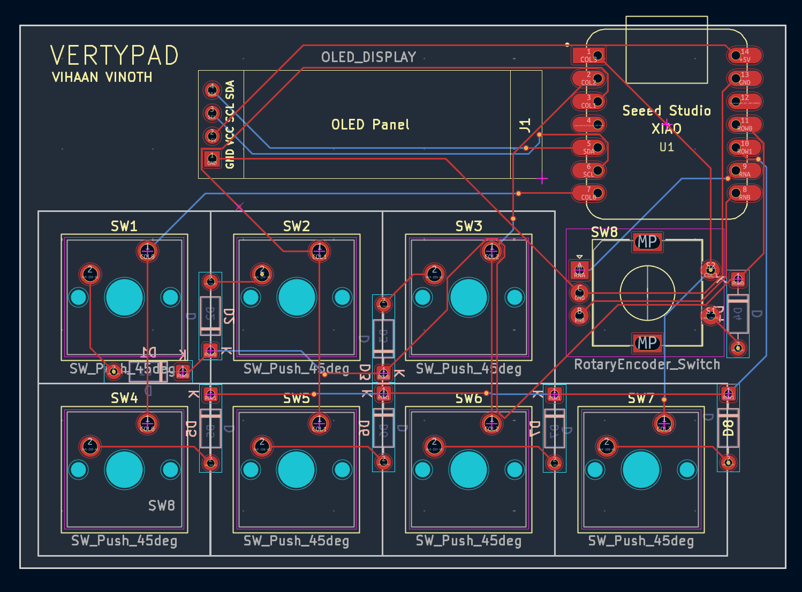
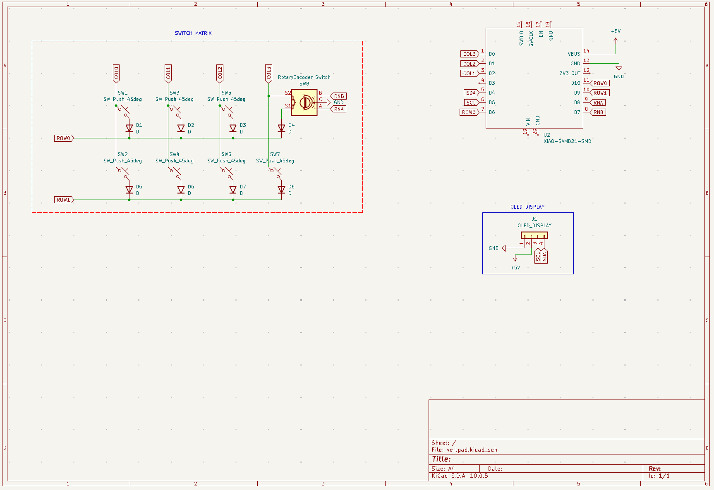
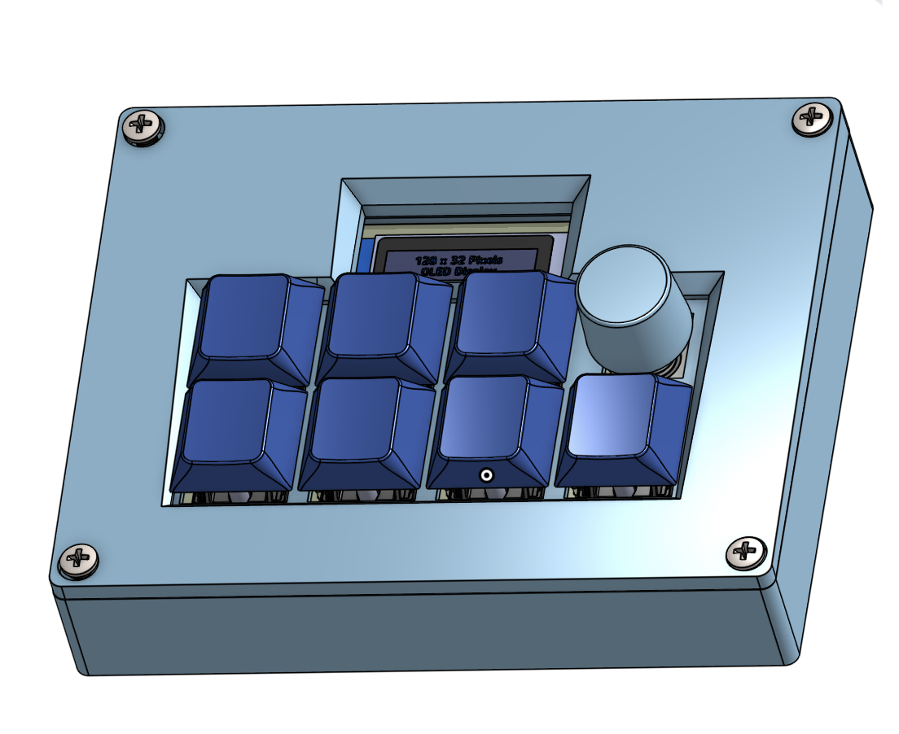

# VertyPad

The **VertyPad** is a custom 4x2 matrix mechanical macropad, featuring a rotary encoder, and a 0.91-inch OLED screen. It is built with the Seeed Studio XIAO RP2040 microcontroller, powered by QMK, and supports **cross-platform switching (macOS and Windows)** with an **interactive OLED UI menu**.

### PCB

### Schematics

### CAD

## BOM

| Component Type | Part Description | Quantity |
| :--- | :--- | :--- | 
| **Microcontroller** | Seeed Studio XIAO RP2040 | 1 |
| **Switches** | Cherry MX-Style Mechanical Switches | 7 |
| **Rotary Encoder** | EC11 Rotary Encoder with Switch | 1 | 
| **Diodes** | 1N4148 Through-Hole Signal Diodes | 8 |
| **Display Panel** | 0.91-inch I2C Monochromatic OLED | 1 | 
| **Keycaps** | DSA Profile Blank Keycaps | 7 | 
| **Screws**| M3 x 16mm Screws | 4 | 
| **Case** | 3D Printed Case/Plate | 1 |
| **PCB** | A PCB | 1 |

## Keymap & Feature Profiles

The VertyPad supports various macro commands across MacOS and Windows:

* **Copy:** `Command + C` (macOS) or `Control + C` (Windows).
* **Paste:** `Command + V` (macOS) or `Control + V` (Windows).
* **Spotlight/Search:** Launches Apple Spotlight Search (`Cmd + Space`) or Windows Search (`Win + S`).
* **Lock:** Locks the screen (`Cmd + Ctrl + Q` on Mac, `Win + L` on Windows).
* **Standard Keycodes:** Standard layout keycodes (`KC_4` and `KC_6`).
* **UI Select** Interactively toggles configuration states, such as switching between macOS and Windows modes on the OLED screen.
* **Rotary Dial Turn:** Cycles forward and backward through the **OLED UI menu screens** (Dashboard, OS Config, and Hardware Status).
* **Encoder Click Button (SW8):** Instant system audio stream mute toggle (`KC_MUTE`).